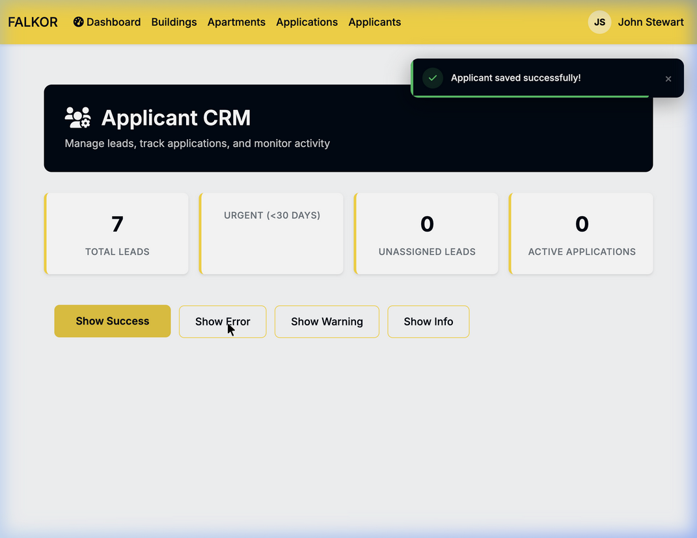
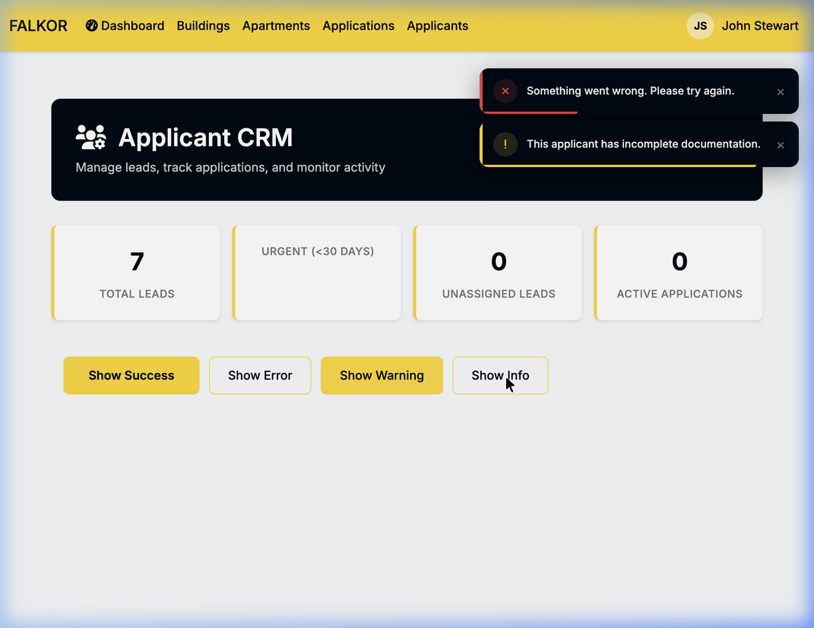

# Falkor — Django Messages Reference

Complete catalog of every `messages.success()`, `messages.error()`, `messages.warning()`, and `messages.info()` call across the entire platform.

**Total: 302 message calls** — 160 error · 93 success · 21 info · 13 warning · 15 dynamic

> **Last audited:** April 8, 2026  
> **Search method:** `grep -rn` across all `.py` files, verified per-app with `grep_search`

---

## Toast Notification Design

All Django messages render as premium slide-in toasts (top-right, fixed). Defined in [`doorway-theme.css`](../static/css/doorway-theme.css) § "Toast Notifications" and rendered in [`base.html`](../templates/base.html) + [`applicant_base.html`](../applications/templates/applications/applicant_base.html).

| Type | Accent Color | Icon | CSS Class | Auto-Dismiss |
|------|-------------|------|-----------|-------------|
| ✅ Success | `#22c55e` green | `fa-check` | `.toast-success` | 5 seconds |
| ❌ Error | `#ef4444` red | `fa-xmark` | `.toast-error` | 5 seconds |
| ⚠️ Warning | `#ffd60a` yellow | `fa-exclamation` | `.toast-warning` | 5 seconds |
| ℹ️ Info | `#3b82f6` blue | `fa-info` | `.toast-info` | 5 seconds |

---

## 1. Users App (`users/`)

### 1.1 Authentication & Login
_Source: [`users/views.py`](../users/views.py)_

| Type | Message | Trigger | Line |
|------|---------|---------|------|
| ✅ | `Welcome back, {name}!` | Successful login | 51 |
| ❌ | `Invalid email or password.` | Failed login | 63 |
| ✅ | `You have been successfully logged out.` | Logout | 73 |

### 1.2 Account Creation (Admin)
_Source: [`users/views.py`](../users/views.py)_

| Type | Message | Trigger | Line |
|------|---------|---------|------|
| ❌ | `Access denied. Only administrators can create broker accounts.` | Non-admin creates broker | 97 |
| ❌ | `A user with email {email} already exists.` | Duplicate email | 106 |
| ✅ | `Broker account created for {email} and invitation email sent.` | Broker created + email | 118 |
| ⚠️ | `Broker account created but email sending failed. Please resend invitation.` | Broker created, email failed | 122 |
| ❌ | `Access denied. Only superusers can create staff accounts.` | Non-superuser creates staff | 242 |
| ✅ | `Staff account created for {email} and invitation email sent.` | Staff created | 256 |
| ❌ | `Access denied. Only administrators can create owner accounts.` | Non-admin creates owner | 268 |
| ✅ | `Owner account created for {email} and invitation email sent.` | Owner created | 282 |

### 1.3 Unified Account Creation
_Source: [`users/views.py`](../users/views.py)_

| Type | Message | Trigger | Line |
|------|---------|---------|------|
| ❌ | `Access denied. Administrator privileges required.` | Non-admin access | 801, 830 |
| ❌ | `Access denied. Only superusers can create staff accounts.` | Non-superuser staff | 836 |
| ❌ | `A user with this email already exists.` | Duplicate email | 843 |
| ✅ | `{AccountType} account created for {email} and invitation email sent.` | Account created | 863 |
| ⚠️ | `{AccountType} account created for {email}, but email sending failed.` | Account created, email failed | 865 |

### 1.4 Registration & Email Verification
_Sources: [`users/views.py`](../users/views.py), [`users/email_views.py`](../users/email_views.py)_

| Type | Message | Trigger | Line |
|------|---------|---------|------|
| ℹ️ | `We've sent a verification code to your email. Please check your inbox...` | Applicant registration | views:220 |
| ⚠️ | `Account created, but we couldn't send the verification email...` | Email failure | views:229 |
| ✅ | `Your email has been verified and account activated! Welcome to DoorWay!` | Email verified (new) | email_views:106 |
| ✅ | `Email verified! Please log in.` | Email verified (existing) | email_views:121 |
| ❌ | `No email address to verify` | Missing email in session | email_views:38 |
| ❌ | `Registration data not found. Please register again.` | Session expired | email_views:125 |
| ❌ | `{dynamic message}` | Verification code error | email_views:140 |

### 1.5 Invitation & Activation Links
_Source: [`users/views.py`](../users/views.py)_

| Type | Message | Trigger | Line |
|------|---------|---------|------|
| ❌ | `Invalid or expired invitation link.` | Bad invite token | 745 |
| ❌ | `Password must be at least 8 characters long.` | Short password | 753 |
| ❌ | `Passwords do not match.` | Mismatched passwords | 755 |
| ✅ | `Password set successfully! Welcome to {SITE_NAME}.` | Password set via invite | 765 |
| ❌ | `Invalid or expired activation link.` | Bad activation token | 782 |
| ℹ️ | `Account is already activated.` | Re-visiting activation link | 786 |
| ✅ | `Account activated successfully! You can now log in.` | Successful activation | 793 |

### 1.6 SMS Registration Flow
_Sources: [`users/sms_views.py`](../users/sms_views.py), [`users/sms_views_updated.py`](../users/sms_views_updated.py), [`users/views_sms_integrated.py`](../users/views_sms_integrated.py)_

| Type | Message | Trigger | Source |
|------|---------|---------|--------|
| ✅ | `Welcome! Your account has been created. You can now complete your profile.` | SMS-integrated creation | views_sms_integrated:57 |
| ❌ | `No phone number to verify` | Missing phone in session | sms_views:41, sms_views_updated:19, 93 |
| ✅ | `Phone number verified successfully!` | Phone verified | sms_views_updated:53 |
| ✅ | `SMS preferences updated successfully!` | SMS prefs saved | sms_views:248 |
| ❌ | `Please add a phone number first` | No phone for verification | sms_views:288 |
| ℹ️ | `Your phone is already verified` | Re-verifying | sms_views:292 |
| ❌ | `Registration data not found. Please register again.` | Session expired | sms_views:107, sms_views_updated:159 |
| ❌ | `{dynamic message}` | Verification code error | sms_views:148, 246, 314; sms_views_updated:61, 200 |
| ✅ | `{dynamic message}` | Verification success | sms_views:93, 98, 311; sms_views_updated:145, 150 |
| ℹ️ | `{dynamic message}` | Verification info | sms_views:243; views_sms_integrated:115 |
| ⚠️ | `{dynamic message}` | Verification warning | views_sms_integrated:124 |
| ✅ | `{dynamic message}` | SMS success | views_sms_integrated:178 |

### 1.7 Access Control (Role Guards)
_Source: [`users/views.py`](../users/views.py)_

| Type | Message | Trigger | Line |
|------|---------|---------|------|
| ❌ | `Access denied. Admin privileges required.` | Non-admin | 294 |
| ❌ | `Access denied. Broker privileges required.` | Non-broker | 368 |
| ❌ | `Access denied. Applicant privileges required.` | Non-applicant | 591 |
| ❌ | `Access denied. Owner privileges required.` | Non-owner | 680 |
| ❌ | `Access denied. Staff privileges required.` | Non-staff | 693 |

### 1.8 Profile Management
_Source: [`users/profile_views.py`](../users/profile_views.py)_

| Type | Message | Trigger | Line |
|------|---------|---------|------|
| ❌ | `Access denied. This page is for brokers only.` | Wrong role | 17 |
| ❌ | `Access denied. This page is for property owners only.` | Wrong role | 120 |
| ❌ | `Access denied. This page is for staff members only.` | Wrong role | 197 |
| ❌ | `Access denied. This page is for administrators only.` | Wrong role | 412 |
| ❌ | `Access denied.` | Generic (progressive steps) | 270, 317, 364, 483 |
| ✅ | `Congratulations! Your broker profile is now complete.` | 100% complete | 90 |
| ✅ | `Congratulations! Your owner profile is now complete.` | 100% complete | 152 |
| ✅ | `Congratulations! Your staff profile is now complete.` | 100% complete | 228 |
| ✅ | `Congratulations! Your admin profile is now complete.` | 100% complete | 441 |
| ✅ | `Great progress! Your profile is now {n}% complete.` | Partial progress | 92, 154, 230, 443 |
| ✅ | `Profile updated successfully.` | Saved (no milestone) | 94, 156, 232, 445 |
| ✅ | `Profile updated! Keep going to complete it.` | Progressive step saved | 290, 337, 384, 503 |
| ℹ️ | `Your broker profile is complete!` | Already complete redirect | 282 |
| ℹ️ | `Your owner profile is complete!` | Already complete redirect | 329 |
| ℹ️ | `Your staff profile is complete!` | Already complete redirect | 376 |
| ℹ️ | `Your admin profile is complete!` | Already complete redirect | 495 |

---

## 2. Applications App (`applications/`)

### 2.1 File & Document Management
_Source: [`applications/views.py`](../applications/views.py)_

| Type | Message | Trigger | Line |
|------|---------|---------|------|
| ✅ | `File deleted successfully.` | Cloudinary file deletion | 214 |
| ❌ | `Error deleting file: {error}` | Deletion failure | 217 |
| ⚠️ | `Warning: Cloudinary deletion returned: {result}` | Unexpected Cloudinary response | 194 |
| ✅ | `Document '{type}' uploaded successfully!` | V2 document upload | 1703 |
| ✅ | `'{type}' uploaded and linked to application! AI analysis started.` | Upload + AI analysis | 1834 |
| ⚠️ | `All {type} slots are filled. Uploaded for AI analysis only.` | Document slots full | 1836 |
| ❌ | `Please select a document type and file to upload.` | Missing upload fields | 1850 |
| ❌ | `Error uploading file: {error}` | Upload exception | 1848 |

### 2.2 AI Document Analysis
_Source: [`applications/views.py`](../applications/views.py)_

| Type | Message | Trigger | Line |
|------|---------|---------|------|
| ✅ | `🔄 Document analysis started! The AI is processing '{type}' in the background...` | AI triggered | 629 |
| ℹ️ | `⏱️ This process may take several minutes. You can refresh the page...` | Companion info | 630 |
| ❌ | `❌ Error starting document analysis: {error}` | AI failure | 633 |
| ❌ | `You are not authorized to analyze this file.` | Unauthorized | 610 |

### 2.3 Application Links & Access
_Sources: [`applications/views.py`](../applications/views.py), [`applications/access_control.py`](../applications/access_control.py)_

| Type | Message | Trigger | Line |
|------|---------|---------|------|
| ✅ | `Application link sent to {email}` | Email sent | views:257 |
| ❌ | `You are not authorized to send this application. Only the creating broker can send links.` | Wrong broker | views:244 |
| ❌ | `Cannot send application - no applicant email found.` | Missing email | views:249 |
| ❌ | `Failed to send email. Please try again later.` | Email failure | views:260 |
| ❌ | `You are not authorized to access this application.` | Access denied | access_control:73 |

### 2.4 Application Revocation
_Source: [`applications/views.py`](../applications/views.py)_

| Type | Message | Trigger | Line |
|------|---------|---------|------|
| ✅ | `Application access has been revoked. Reason: {reason}` | Revoked | 315 |
| ⚠️ | `This application has already been revoked.` | Re-revoking | 277 |
| ❌ | `You are not authorized to revoke this application.` | Unauthorized | 272 |
| ❌ | `Please select a reason for revoking the application.` | Missing reason | 285 |
| ❌ | `Please provide a reason when selecting 'Other'.` | Empty "Other" | 291 |

### 2.5 Application Approval
_Source: [`applications/views.py`](../applications/views.py)_

| Type | Message | Trigger | Line |
|------|---------|---------|------|
| ✅ | `Application approved successfully!` | Full approval | 767 |
| ⚠️ | `Application is already approved.` | Re-approving | 750 |
| ⚠️ | `Warning: Application has missing documents. Approved anyway.` | Approve with gaps | 755 |

### 2.6 SMS & Communication
_Source: [`applications/views.py`](../applications/views.py)_

| Type | Message | Trigger | Line |
|------|---------|---------|------|
| ✅ | `SMS sent successfully to {phone}!` | SMS delivered | 400 |
| ❌ | `You are not authorized to send SMS for this application.` | Unauthorized | 360 |
| ❌ | `Please enter a message to send.` | Empty message | 378 |
| ❌ | `No phone number found for this applicant.` | Missing phone | 391, 523 |
| ❌ | `SMS sending failed: {result}` | API failure | 454, 562, 593 |
| ❌ | `SMS sending failed: {error}` | Exception | 457 |
| ✅ | `Nudge sent to {first_name}!` | Nudge sent | 729 |
| ❌ | `You are not authorized to nudge this applicant.` | Unauthorized | 723 |
| ✅ | `{dynamic message}` | AI reminder sent | 446, 556 |

### 2.7 AI Missing Fields Reminder
_Source: [`applications/views.py`](../applications/views.py)_

| Type | Message | Trigger | Line |
|------|---------|---------|------|
| ℹ️ | `No missing fields to collect via SMS. All safe-to-collect fields are filled!` | All filled | 497 |
| ❌ | `You are not authorized to send reminders for this application.` | Unauthorized | 486 |
| ❌ | `Failed to send reminder: {error}` | Exception | 564 |

### 2.8 Testing (Admin Only)
_Source: [`applications/views.py`](../applications/views.py)_

| Type | Message | Trigger | Line |
|------|---------|---------|------|
| ✅ | `Test email sent successfully to {email}` | Admin test email | 342 |
| ❌ | `Only administrators can test email functionality.` | Non-admin | 324 |
| ❌ | `Email sending failed: {error}` | Test email failure | 344 |
| ❌ | `Please provide a test email address.` | Empty email | 346 |
| ✅ | `Test SMS sent successfully to {phone}! Message ID: {id}` | Admin test SMS | 591 |
| ❌ | `Only administrators can test SMS functionality.` | Non-admin | 573 |
| ❌ | `Invalid phone number format: {phone}` | Bad phone | 585 |
| ❌ | `SMS testing failed: {error}` | Test SMS failure | 596 |
| ❌ | `Please provide a test phone number.` | Empty phone | 598 |

### 2.9 Application V2 — Section Saves
_Source: [`applications/views.py`](../applications/views.py)_

| Type | Message | Trigger | Line |
|------|---------|---------|------|
| ✅ | `Personal information saved successfully!` | Section 1 | 1489, 3056 |
| ✅ | `Income information saved successfully!` | Section 2 | 2317 |
| ✅ | `Legal documents signed successfully!` | Section 3 | 2536 |
| ✅ | `Review complete! Proceeding to payment...` | Section 4 | 2771 |
| ❌ | `Please correct the errors below.` | Validation failure | 2336 |
| ❌ | `Please sign all required documents before continuing.` | Missing sigs | 2543 |
| ❌ | `Please complete all sections before proceeding to payment.` | Incomplete | 2752 |

### 2.10 Application V2 — Step Guards
_Source: [`applications/views.py`](../applications/views.py)_

| Type | Message | Trigger | Line |
|------|---------|---------|------|
| ⚠️ | `Please complete step 1 first.` | Skipping to step 2 | 896 |
| ⚠️ | `Please complete previous steps first.` | Skipping steps | 982 |

### 2.11 Payment Processing
_Source: [`applications/views.py`](../applications/views.py)_

| Type | Message | Trigger | Line |
|------|---------|---------|------|
| ℹ️ | `Payment has already been processed for this application.` | Re-visiting payment | 2837 |
| ❌ | `Please fill in all required payment fields.` | Missing fields | 2866 |
| ✅ | `{dynamic message}` | Payment success (Cardknox) | 2894 |
| ❌ | `Payment failed: {message}` | Payment error | 2906 |

### 2.12 Application Creation
_Source: [`applications/views.py`](../applications/views.py)_

| Type | Message | Trigger | Line |
|------|---------|---------|------|
| ✅ | `Application created successfully!` | Legacy app created | 1000 |
| ✅ | `New V2 application created for {apartment}` | V2 with apartment | 1264 |
| ✅ | `New V2 application created. Please add property details in Section 1.` | V2 without apartment | 1267 |

### 2.13 Authorization Guards
_Source: [`applications/views.py`](../applications/views.py)_

| Type | Message | Trigger | Line |
|------|---------|---------|------|
| ❌ | `You are not authorized to preview this application.` | Unauthorized | 2942 |
| ❌ | `You are not authorized to pre-fill this application.` | Unauthorized | 2956, 3028 |

### 2.14 Account Creation from Application
_Source: [`applications/account_views.py`](../applications/account_views.py)_

| Type | Message | Trigger | Line |
|------|---------|---------|------|
| ❌ | `Unable to create account - no email found.` | Missing email | 37 |
| ❌ | `{dynamic error}` | Account creation errors | 49 |
| ⚠️ | `Please complete your application first.` | Premature creation | 22 |
| ℹ️ | `You already have an account. Please log in.` | Existing account | 27 |
| ℹ️ | `You can create an account anytime using the link in your email.` | Skip account | 69 |

---

## 3. Apartments App (`apartments/`)

### 3.1 Apartment Edit
_Source: [`apartments/views.py`](../apartments/views.py)_

| Type | Message | Trigger | Line |
|------|---------|---------|------|
| ✅ | `Apartment details saved successfully.` | Apartment info saved | 212 |
| ✅ | `Image uploaded successfully.` | Image upload on edit page | 221 |

### 3.2 Apartment Creation Wizard — Step 1
_Source: [`apartments/views.py`](../apartments/views.py)_

| Type | Message | Trigger | Line |
|------|---------|---------|------|
| ✅ | `Apartment {unit} created successfully! Now let's add images.` | Step 1 save | 403 |
| ❌ | `Please correct the errors below and try again.` | Validation | 406 |

### 3.3 Apartment Creation Wizard — Step 2 (Images)
_Source: [`apartments/views.py`](../apartments/views.py)_

| Type | Message | Trigger | Line |
|------|---------|---------|------|
| ❌ | `Apartment not found.` | Missing apartment | 428 |
| ✅ | `Image uploaded successfully.` | Image upload | 440 |
| ❌ | `Failed to upload image. Please try again.` | Upload failure | 444 |
| ❌ | `Invalid image file. Please select a valid image.` | Bad file | 446 |
| ℹ️ | `Skipped image upload. You can add images later.` | User skips | 449 |

### 3.4 Apartment Creation Wizard — Step 3 (Amenities)
_Source: [`apartments/views.py`](../apartments/views.py)_

| Type | Message | Trigger | Line |
|------|---------|---------|------|
| ❌ | `Apartment not found.` | Missing apartment | 472 |
| ✅ | `Amenities and features saved successfully.` | Amenities saved | 482 |
| ❌ | `Failed to save amenities. Please try again.` | Save failure | 486 |
| ❌ | `Please correct the errors and try again.` | Form errors | 488 |
| ℹ️ | `Skipped amenities. You can add these later.` | User skips | 491 |

### 3.5 Apartment Creation Wizard — Step 4 (Details)
_Source: [`apartments/views.py`](../apartments/views.py)_

| Type | Message | Trigger | Line |
|------|---------|---------|------|
| ❌ | `Apartment not found.` | Missing apartment | 511 |
| ✅ | `Additional details saved successfully.` | Details saved | 521 |
| ❌ | `Failed to save details. Please try again.` | Save failure | 525 |
| ❌ | `Please correct the errors and try again.` | Form errors | 527 |
| ℹ️ | `Skipped additional details. You can add these later.` | User skips | 530 |

### 3.6 Apartment Complete
_Source: [`apartments/views.py`](../apartments/views.py)_

| Type | Message | Trigger | Line |
|------|---------|---------|------|
| ❌ | `Apartment not found.` | Missing apartment | 550 |

### 3.7 Contact Broker
_Source: [`apartments/views.py`](../apartments/views.py)_

| Type | Message | Trigger | Line |
|------|---------|---------|------|
| ✅ | `Your message has been sent to the broker. You should hear back within 24 hours!` | Contact sent | 585 |
| ⚠️ | `Message sent, but no broker contact information is available for this property.` | No broker contact | 587 |
| ❌ | `There was an error sending your message. Please try again.` | Send failure | 591 |
| ❌ | `{field}: {error}` | Form validation (dynamic per field) | 596 |

---

## 4. Buildings App (`buildings/`)

### 4.1 Authentication Guards
_Sources: [`buildings/decorators.py`](../buildings/decorators.py), [`buildings/middleware.py`](../buildings/middleware.py)_

| Type | Message | Trigger | Source |
|------|---------|---------|--------|
| ❌ | `Please log in to access this page.` | Unauthenticated | decorators:20, 50 |
| ❌ | `🚫 Access denied. Building creation and editing requires administrator privileges. You can view building information but cannot make changes.` | Non-admin edit | decorators:63 |
| ❌ | `🚫 Access denied. Building creation and editing requires administrator privileges.` | Non-admin (middleware) | middleware:36 |

### 4.2 Building Creation Wizard — Step 1
_Source: [`buildings/views.py`](../buildings/views.py)_

| Type | Message | Trigger | Line |
|------|---------|---------|------|
| ✅ | `Building "{name}" created successfully! Now let's add some images.` | Building created | 65 |
| ❌ | `Please correct the errors below and try again.` | Validation | 72 |
| ❌ | `Building not found. Please try again.` | Lookup failure | 80 |

### 4.3 Building Creation — Inline Uploads (Step 1 cont.)
_Source: [`buildings/views.py`](../buildings/views.py)_

| Type | Message | Trigger | Line |
|------|---------|---------|------|
| ✅ | `Image uploaded successfully.` | Image upload | 90 |
| ❌ | `Failed to upload image. Please try again.` | Upload failure | 93 |
| ❌ | `Invalid image file. Please select a valid image.` | Bad file | 95 |
| ✅ | `Access point added successfully.` | Access saved | 104 |
| ❌ | `Failed to add access point. Please try again.` | Save failure | 107 |
| ❌ | `Please correct the access point information and try again.` | Form errors | 109 |
| ✅ | `Special added successfully.` | Special saved | 118 |
| ❌ | `Failed to add special. Please try again.` | Save failure | 121 |
| ❌ | `Please correct the special information and try again.` | Form errors | 123 |
| ❌ | `An unexpected error occurred. Please try again.` | Catch-all | 127 |

### 4.4 Building Wizard — Step 2 (Images)
_Source: [`buildings/views.py`](../buildings/views.py)_

| Type | Message | Trigger | Line |
|------|---------|---------|------|
| ❌ | `Building not found.` | Missing building | 145 |
| ✅ | `Image uploaded successfully.` | Image upload | 158 |
| ❌ | `Failed to upload image. Please try again.` | Upload failure | 163 |
| ❌ | `Invalid image file. Please select a valid image.` | Bad file | 165 |
| ℹ️ | `Skipped image upload. You can add images later.` | User skips | 168 |

### 4.5 Building Wizard — Step 3 (Access)
_Source: [`buildings/views.py`](../buildings/views.py)_

| Type | Message | Trigger | Line |
|------|---------|---------|------|
| ❌ | `Building not found.` | Missing building | 190 |
| ✅ | `Access information added successfully.` | Access saved | 203 |
| ❌ | `Failed to add access information. Please try again.` | Save failure | 207 |
| ❌ | `Please correct the errors and try again.` | Form errors | 209 |
| ℹ️ | `Skipped access information. You can add this later.` | User skips | 212 |

### 4.6 Building Wizard — Step 4 (Specials)
_Source: [`buildings/views.py`](../buildings/views.py)_

| Type | Message | Trigger | Line |
|------|---------|---------|------|
| ❌ | `Building not found.` | Missing building | 234 |
| ✅ | `Special offer added successfully.` | Special saved | 247 |
| ❌ | `Failed to add special offer. Please try again.` | Save failure | 251 |
| ❌ | `Please correct the errors and try again.` | Form errors | 253 |
| ℹ️ | `Skipped special offers. You can add these later.` | User skips | 256 |

### 4.7 Building Complete & Overview
_Source: [`buildings/views.py`](../buildings/views.py)_

| Type | Message | Trigger | Line |
|------|---------|---------|------|
| ❌ | `Building not found.` | Missing building | 278, 300, 416 |
| ❌ | `An error occurred while loading the buildings list. Please try again.` | List error | 42 |
| ❌ | `An error occurred while loading the building overview. Please try again.` | Overview error | 420 |

### 4.8 Building Detail (Edit)
_Source: [`buildings/views.py`](../buildings/views.py)_

| Type | Message | Trigger | Line |
|------|---------|---------|------|
| ✅ | `Building information updated successfully.` | Info saved | 316 |
| ❌ | `Please correct the errors below and try again.` | Validation | 319 |
| ✅ | `Image uploaded successfully.` | Image upload | 329 |
| ❌ | `Failed to upload image. Please try again.` | Upload failure | 333 |
| ❌ | `Invalid image file. Please select a valid image.` | Bad file | 335 |
| ✅ | `Access point added successfully.` | Access saved | 345 |
| ❌ | `Failed to add access point. Please try again.` | Save failure | 349 |
| ❌ | `Please correct the access point information and try again.` | Form errors | 351 |
| ✅ | `Special added successfully.` | Special saved | 361 |
| ❌ | `Failed to add special. Please try again.` | Save failure | 365 |
| ❌ | `Please correct the special information and try again.` | Form errors | 367 |
| ❌ | `An unexpected error occurred. Please try again.` | Catch-all | 371 |

---

## 5. Applicants App (`applicants/`)

### 5.1 Profile — Quick Update & Summary
_Source: [`applicants/profile_views.py`](../applicants/profile_views.py)_

| Type | Message | Trigger | Line |
|------|---------|---------|------|
| ℹ️ | `Your profile is complete!` | Already-complete redirect | 58 |
| ✅ | `Profile updated! Keep going to complete it.` | Quick update save | 66 |

### 5.2 Profile — Step 1 (Basic Info)
_Source: [`applicants/profile_views.py`](../applicants/profile_views.py)_

| Type | Message | Trigger | Line |
|------|---------|---------|------|
| ✅ | `Basic information saved! Let's continue with your housing preferences.` | Step 1 save | 311 |

### 5.3 Profile — Step 2 (Housing Preferences)
_Source: [`applicants/profile_views.py`](../applicants/profile_views.py)_

| Type | Message | Trigger | Line |
|------|---------|---------|------|
| ✅ | `Housing preferences saved! Let's finish with employment information.` | Step 2 save | 522 |

### 5.4 Profile — Step 3 (Employment & Income)
_Source: [`applicants/profile_views.py`](../applicants/profile_views.py)_

| Type | Message | Trigger | Line |
|------|---------|---------|------|
| ✅ | `Congratulations! Your profile is now complete.` | 100% complete | 631 |
| ✅ | `Profile updated! Your profile is now {n}% complete.` | Partial progress | 633 |
| ❌ | `Please correct the errors below: {form.errors}` | Validation errors | 637 |

### 5.5 CRM Actions
_Source: [`applicants/views.py`](../applicants/views.py)_

| Type | Message | Trigger | Line |
|------|---------|---------|------|
| ✅ | `Applicant photo deleted successfully!` | Photo deletion | 41 |
| ✅ | `Pet photo deleted successfully!` | Pet photo deletion | 59 |
| ❌ | `You do not have permission to modify this applicant.` | Unauthorized edit | 36, 54 |
| ❌ | `You do not have permission to view this applicant.` | Unauthorized view | 75 |
| ❌ | `You do not have permission to view this applicant's CRM.` | Unauthorized CRM | 321 |
| ✅ | `{method} sent successfully!` | CRM outreach (email/SMS) | 352 |
| ❌ | `Failed to send {method}: {error}` | CRM outreach failure | 354 |
| ✅ | `Note added successfully.` | CRM note saved | 366 |

---

## Summary by Module

| Module | ✅ Success | ❌ Error | ⚠️ Warning | ℹ️ Info | Dynamic |
|--------|-----------|---------|------------|--------|---------|
| Users (auth, profiles, SMS) | 30 | 42 | 4 | 10 | 8 |
| Applications (V2, docs, SMS) | 24 | 35 | 8 | 5 | 5 |
| Apartments (wizard, contact) | 9 | 16 | 1 | 3 | 0 |
| Buildings (wizard, detail) | 12 | 33 | 0 | 3 | 0 |
| Applicants (profile, CRM) | 10 | 5 | 0 | 1 | 1 |
| **Total** | **85** | **131** | **13** | **22** | **14** |

> [!NOTE]
> **"Dynamic"** messages are those where the message text comes from a variable (e.g., `messages.error(request, message)`) or from a service function return value. These are counted separately because the exact text varies at runtime.

> [!TIP]
> Messages are rendered via the toast system in [`doorway-theme.css`](../static/css/doorway-theme.css) § "Toast Notifications". The markup lives in [`base.html`](../templates/base.html) (broker/admin) and [`applicant_base.html`](../applications/templates/applications/applicant_base.html) (applicant flow). Auto-dismiss after 5 seconds with a visible progress bar.
